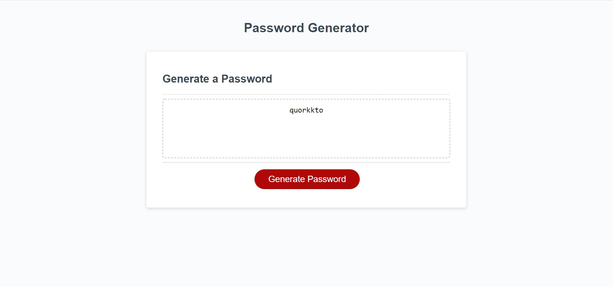

# Password-generator
Generator of random password based on chosen 

## Website
https://sergiionyx.github.io/Password-generator/

Or check the code here: https://github.com/sergiionyx/Password-generator

## Purpose
A website created to generate a password based on chosen criterias:

- optional lenght (8-128 char's);
- can include one or all given options (lower case, upper case, numbers, special characters);
- all characters in password is randomised;

## Built With
* HTML
* CSS
* JavaScript

## Contribution
Made with ❤️ by Sergii Onyshchenko

## Screenshot of website

